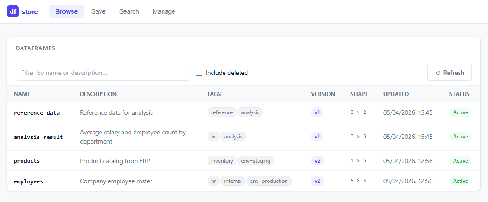

# dfstore

[](https://github.com/tpazur/dfstore/actions/workflows/ci.yml)
[](https://pypi.org/project/dfstore/)
[](https://pypi.org/project/dfstore/)
[](https://pandas.pydata.org/)
[](https://pola.rs/)
[](LICENSE)

A lightweight DataFrame storage library with rich metadata. Save, version, and retrieve pandas and polars DataFrames from a local central store — via Python, CLI, or a web UI.

Use Cases : 
- **Often re-used datasets** - e.g. cleaned/feature-engineered data, reference tables, or intermediate results in a data pipeline
- **Canned Test Data** - datasets you want to easily share across projects or with teammates
- **Data Analysis Results** - e.g. summary tables, model predictions, or experiment results you want to version and explore

## Install

```bash
pip install dfstore          # core
pip install 'dfstore[gui]'   # + web UI
```

## Python API

```python
import dfstore

# Save
dfstore.save(df, name="sales_2024", description="Annual sales", tags=["finance", "region=EU"])

# Load
df = dfstore.get("sales_2024")
df = dfstore.get("sales_2024", version=2)   # specific version

# Explore
dfstore.list()
dfstore.info("sales_2024")
dfstore.versions("sales_2024")
dfstore.search(description="sales", tags=["finance"])

# Delete / restore
dfstore.delete("sales_2024")          # soft delete
dfstore.delete("sales_2024", hard=True)
dfstore.restore("sales_2024")
```

By default the store lives at `~/.dfstore`. Override with the `DFSTORE_PATH` env var or pass `store_path=` to any function.

## CLI

```bash
dfstore save data.csv --name sales_2024 --description "Annual sales" --tags finance --tags region=EU
dfstore get sales_2024
dfstore list
dfstore info sales_2024
dfstore versions sales_2024
dfstore search --description "sales" --tags finance
dfstore delete sales_2024
dfstore restore sales_2024
```

## Web UI

```bash
dfstore serve            # opens at http://127.0.0.1:7860
dfstore serve --port 8080 --host 0.0.0.0
```

Four tabs: **Browse** (filter, click a row to see version history and a data preview), **Save** (upload CSV/Parquet), **Search** (by description, tags, or column names), **Manage** (soft/hard delete and restore).



## Features

- **Versioned** — every save creates a new version; old versions are always accessible
- **Diff tracking** — row count delta, added/removed columns recorded per version
- **pandas & polars** — stores either, returns in whichever library you ask for
- **Zero Infrastructure** — plain files on disk (`~/.dfstore`), no database
- **Soft delete** — hides a DataFrame without removing data; restore at any time

## Support

I'm building dfstore with passion in my free time. If it helps you and your team on your daily data science tasks, please consider supporting the project. Your contribution will help me dedicate more time to improving dfstore and adding new features.

[](https://buymeacoffee.com/tpazur)

